# GLP-1 Analysis — Final Report

This report synthesizes seven analytical questions about the GLP-1 receptor-agonist
class of drugs (Ozempic, Wegovy, Mounjaro, Zepbound, Trulicity, ...) using the
[Kaggle "GLP-1 Weight Loss Drugs Master Dataset (2017-2026)"](https://www.kaggle.com/datasets/devtayyabsajjad/glp-1-weight-loss-drugs-master-dataset-2017-2026)
as the single source of truth.

Each section pairs one paragraph of findings with the relevant figure(s). The
full chronological audit trail — every assumption, scoping call, and data gap —
lives in [`outputs/findings_log.md`](outputs/findings_log.md). Per-figure source
tables are in [`outputs/tables/`](outputs/tables/) (one CSV per chart).

> **Disclaimer.** FAERS reports are *voluntary and unverified*. Everything below
> describes reporting behavior and statistical association, not drug-caused
> incidence or risk. Nothing here is medical, regulatory, or investment advice.

---

## Q1 — Side-effect profile: hospitalization rate per 1,000 FAERS reports

Among the 7 approved GLP-1 generics in FAERS, **liraglutide (178 hosp/1,000 reports, n=9,978)** and **semaglutide (160/1,000, n=14,992)** lead on hospitalization-reporting rate, with dulaglutide a step behind (102/1,000). **Tirzepatide ranks lowest among well-powered drugs (24/1,000, n=9,969)** — but tirzepatide is the newest entrant, so this almost certainly reflects launch-curve compression and the Weber effect (early reports skew minor) rather than an intrinsic safety advantage. **Exenatide's death-reporting rate (72/1,000) is roughly 2-7× any other drug**, consistent with its position as the oldest molecule (FDA-approved 2005) with the most cumulative exposure. Lixisenatide's n=19 is too small to rank.

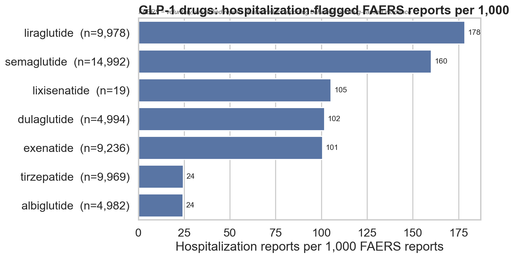

---

## Q2 — Stock price vs Ozempic search interest

US Ozempic search interest is **very strongly correlated with both NVO and LLY stock prices** over 2018–2026: Pearson r = **+0.892** (NVO) and **+0.865** (LLY), both with p ≪ 0.001 (n=100 months). The largest monthly delta-vs-baseline spikes in search interest cluster in **2023-01 through 2023-03 and again in 2024-03 / 2024-05**, mapping cleanly to the viral-Ozempic news cycle and the Wegovy cardiovascular-label expansion. The rolling 12-month correlation is broadly positive after 2022 and noisy before — meaning the search↔price link only really materializes once GLP-1s became a mainstream consumer story. Both series share an obvious common driver (the category becoming a blockbuster); this is correlation, not causation.

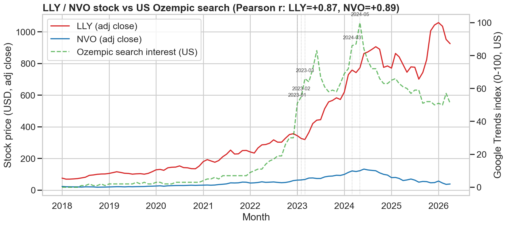

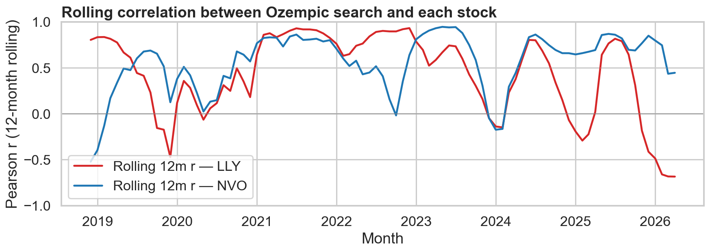

---

## Q3 — Country-level patterns

**FAERS reporting is overwhelmingly US-centric**: the US accounts for **~91% of all geo-tagged GLP-1 reports** (47k of 52k), with Canada, UK, Japan and Brazil rounding out a long tail where no other country exceeds 2%. This says far more about openFDA's reporter footprint than about where GLP-1s are actually used. On the search side, the picture is genuinely different: **Saudi Arabia leads the US** on mean Ozempic search interest (31.0 vs 29.3 over 2018-2026), and **India shows the largest absolute growth 2018→2025 (+64 index points)**, rising from near-zero awareness to a real signal — consistent with rapid private-pay obesity-medication uptake in the Gulf and South Asia. Note that the search-trends dataset only covers 6 actual countries plus a `WORLD` row.

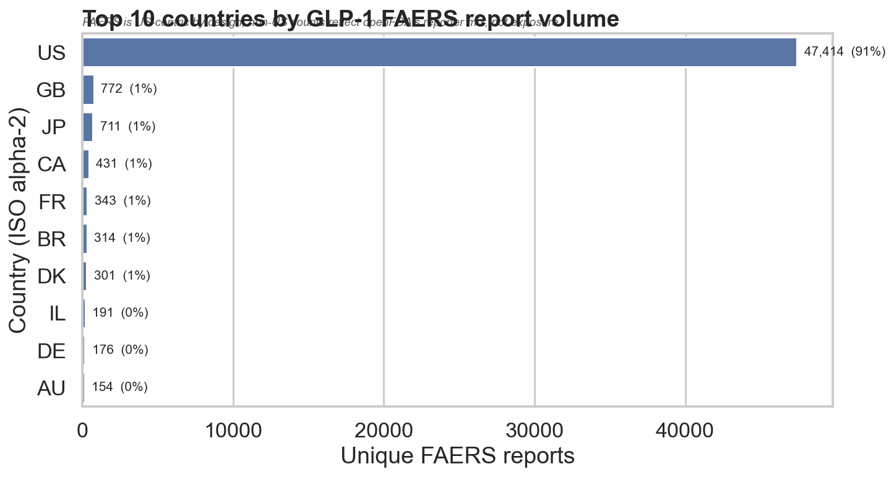

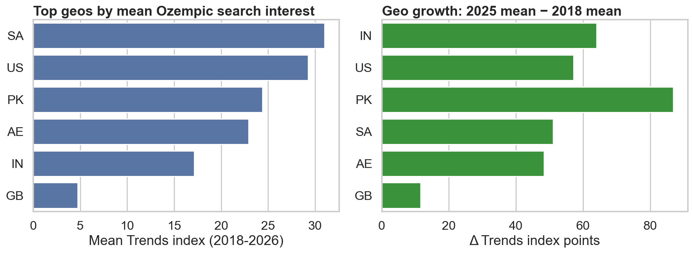

---

## Q4 — Demographics by drug × top reaction

Across all GLP-1 drugs, FAERS reports skew **female and middle-aged**, but the gradient is striking: **tirzepatide reports are 84% female with median age 48**, while **exenatide reports are 61% female with median age 62**. The drugs marketed for weight loss (tirzepatide, semaglutide, liraglutide) attract a younger, more female reporting cohort than the legacy T2D-only drugs (exenatide, dulaglutide, albiglutide). The drug × reaction heatmap reveals reaction-specific age signatures — gastrointestinal reactions cluster in the 40s-50s, while metabolic/hypoglycemia reactions skew older. None of this proves a sex- or age-specific safety signal; it reflects who *takes* (and who *reports about*) each drug.

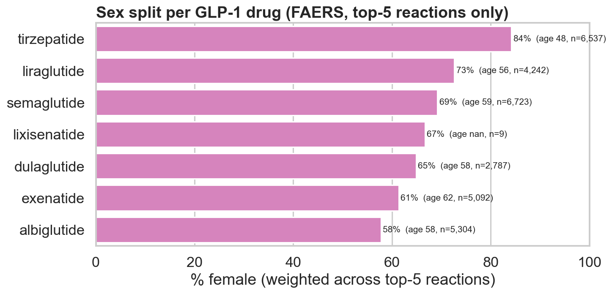

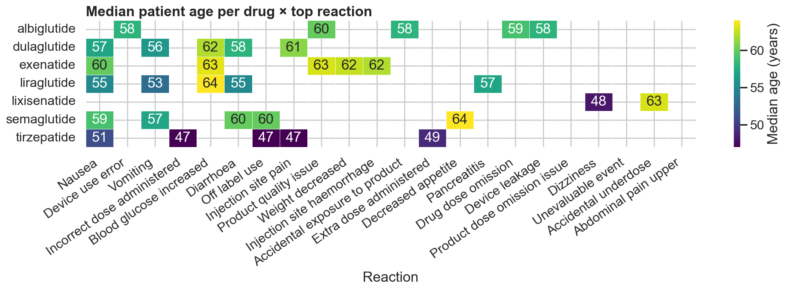

---

## Q5 — Clinical-trial pipeline

The dataset contains **1,953 trials across 9 GLP-1 drugs**, spanning 2004 starts through 2027 planned completions. Phase 3 and Phase 4 dominate, consistent with a class that is in heavy post-approval label-expansion mode. **Novo Nordisk (19.9%) and Eli Lilly (10.6%) lead as sponsors**, but the long tail is enormous: **611 distinct lead sponsors** drive the HHI down to **550 — a competitive market by FTC thresholds** (the top-4 share is only 37%). The temporal facets show a clean generational handoff: exenatide and liraglutide programs peaked in the late 2000s / early 2010s and have wound down, while semaglutide and tirzepatide programs are still accelerating into 2025-2027.

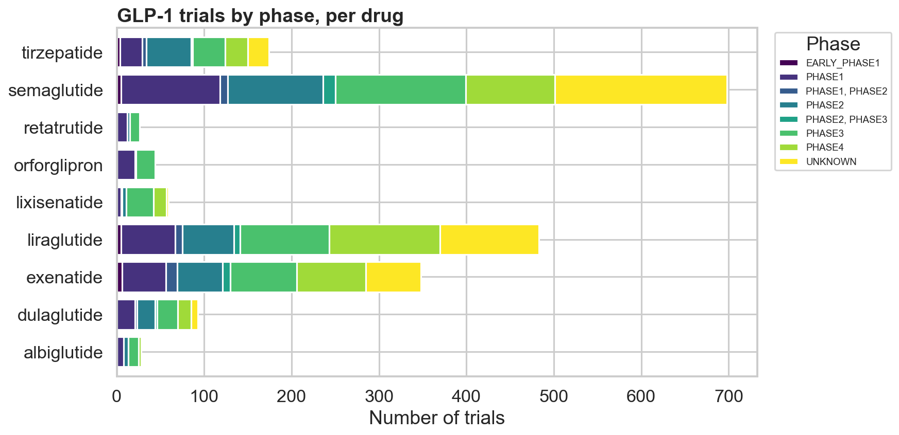

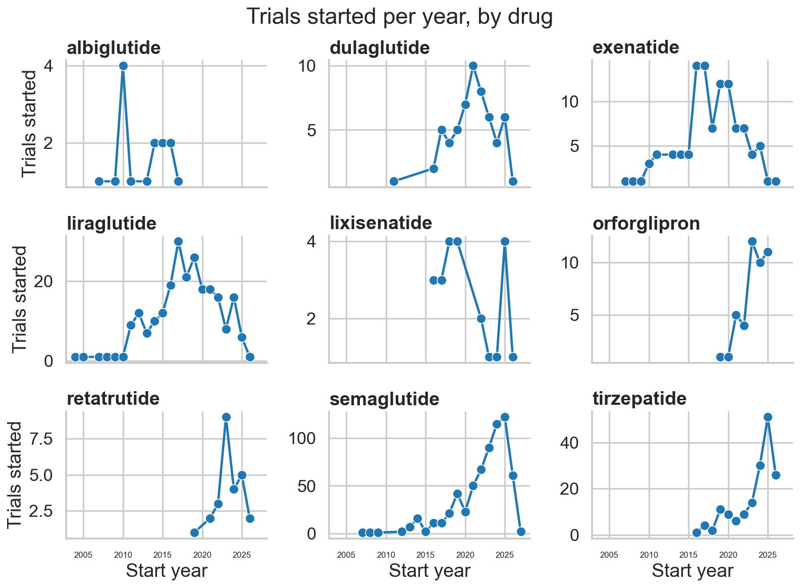

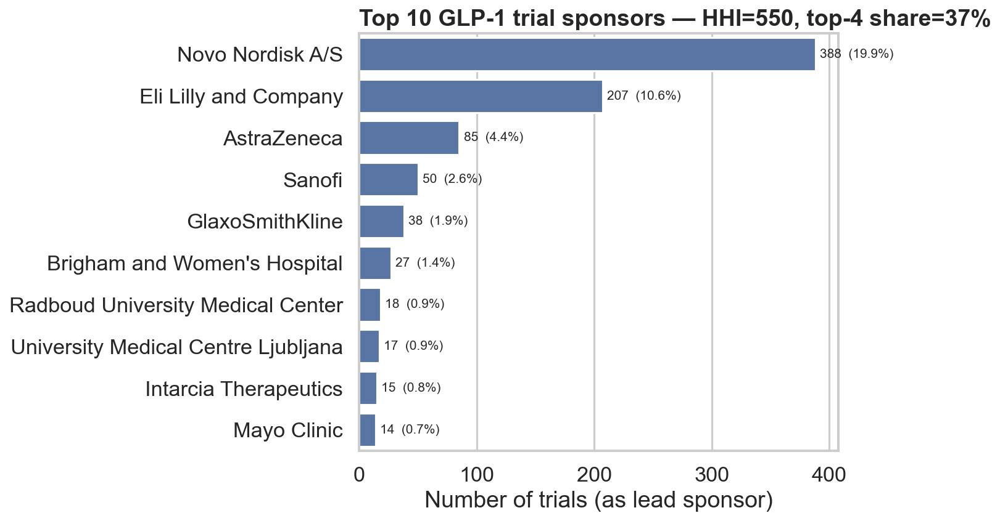

---

## Q6 — Investigational drugs (orforglipron, retatrutide, CagriSema)

After expanding the search to include `brief_title` (CagriSema isn't tagged under `drug_query` — see Limitations), we recover **106 investigational trials**: **orforglipron (45), CagriSema (32), retatrutide (29)**. Orforglipron leads on volume — being an oral GLP-1 makes it easier to dose-range, so Lilly is running more trials in parallel. Active vs completed splits are **orforglipron 14/31, retatrutide 14/15, CagriSema 10/18**, which means all three programs still have meaningful read-out flow ahead. **The bulk of completions cluster in 2025-2027** (peak: 24 trials in 2025), so the next-generation competitive picture for the GLP-1 weight-loss market will be largely decided in the next ~24 months.

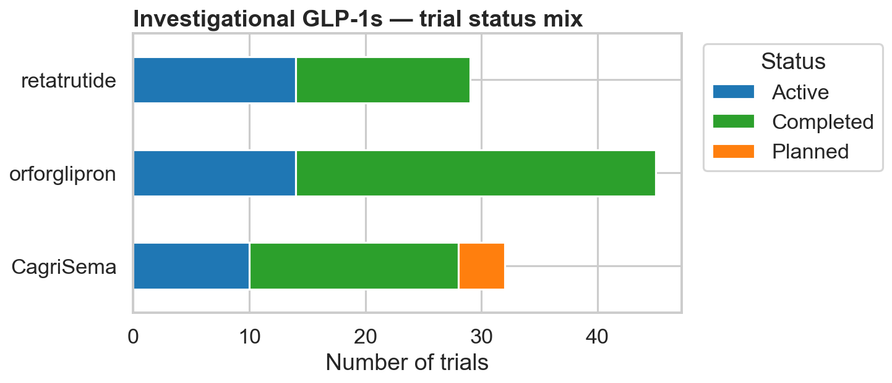

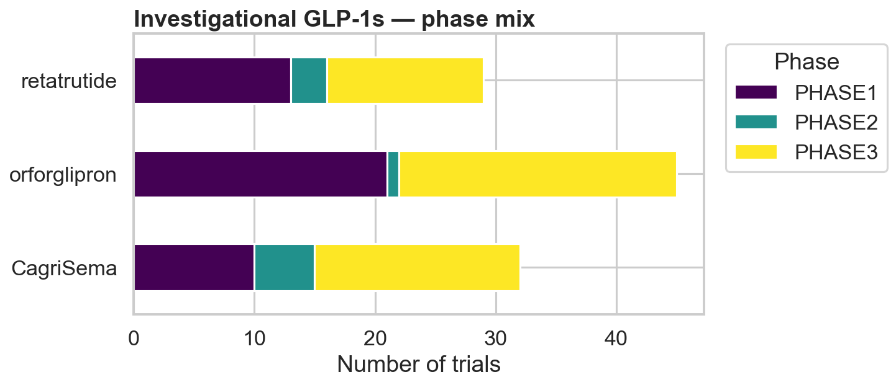

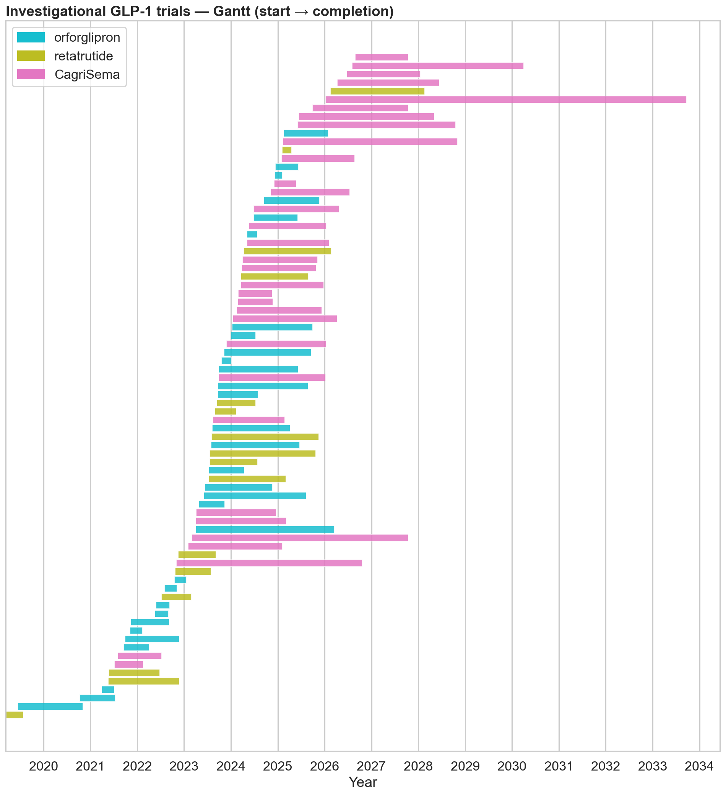

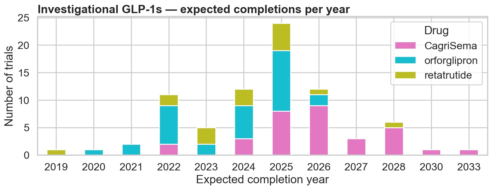

---

## Q7 — Anomaly detection in monthly FAERS reporting

A 6-month rolling z-score flagged **71 drug-months with |z|>2**. Anomalies cluster in **two waves**: 2014-2016 (exenatide-XR & liraglutide ramps, albiglutide failures, ~28 flags) and **2021-2024 (semaglutide weight-loss expansion, tirzepatide launch, viral Ozempic cycle, ~28 flags)**. Tirzepatide and semaglutide tie for most-anomalous (18 each), which is what you'd expect — both are recent high-volume launches where rapid month-over-month growth mathematically inflates z-scores. **Only 3 of 71 anomalies align with the hand-curated `KNOWN_EVENTS` dictionary**, suggesting most flagged months are explained by reporting-cycle dynamics (lawsuit volume, MedWatch outreach, news amplification) rather than discrete drug-related events. The `KNOWN_EVENTS` dict in `notebooks/08_anomaly_detection.ipynb` is designed to be extended.

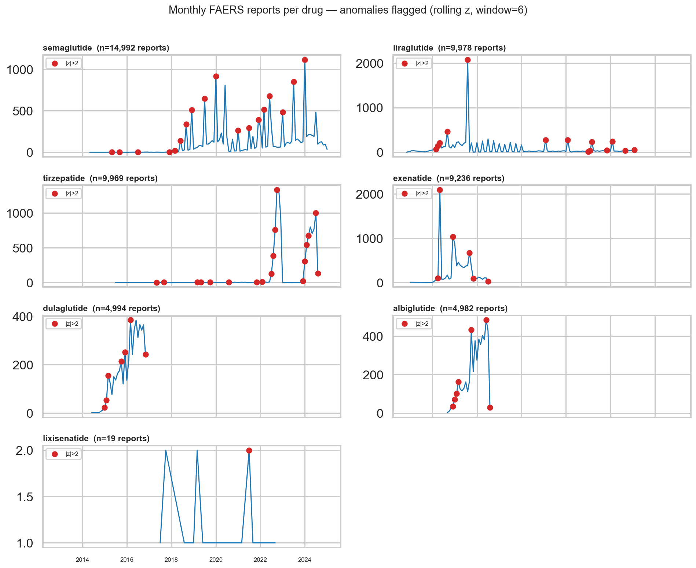

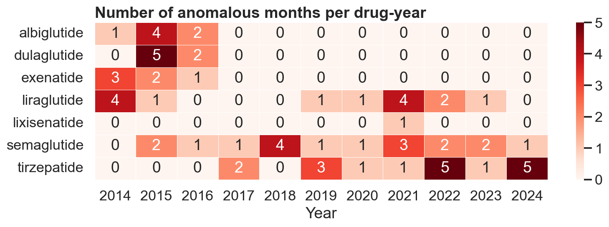

---

## Cross-cutting takeaways

1. **The weight-loss inflection (~2022) shows up in every dataset.** Search spikes, stock-price correlation regime change, female-skew widening, and anomaly clustering all line up around the same window.
2. **Older drugs are death-skewed; newer drugs are hospitalization-skewed.** Exenatide carries the highest death-reporting rate; tirzepatide has the lowest hospitalization rate but the youngest cohort and shortest exposure tail.
3. **The competitive map is not a duopoly.** Novo and Lilly dominate the next-gen pipeline (orforglipron, retatrutide, CagriSema) but the broader trial ecosystem has 600+ sponsors — a structurally competitive scientific field.
4. **FAERS geography is a US-FDA artifact, not an exposure map.** Any analysis of "where GLP-1 problems are reported" is almost entirely a story about openFDA's submission funnel.

---

## Limitations

These cut across the whole project and should accompany every chart:

- **FAERS is voluntary, not a registry.** Reports are submitted by anyone (patients, doctors, lawyers, manufacturers). They reflect *reporting behavior*, not drug-caused incidence. No causal inference is possible from FAERS alone.
- **No exposure denominator.** "Per 1,000 reports" is *not* "per 1,000 patients exposed." A safer drug prescribed 10× more would still generate more reports. True risk comparisons need prescription-volume / patient-year data this dataset does not include.
- **Weber & channeling effects.** Reporting peaks shortly after launch and decays. Comparing exenatide (2005) to tirzepatide (2022) is partly a comparison of those launch curves, not the molecules. Drugs given to sicker populations (older T2D patients with comorbidities) also look worse on every metric.
- **Google Trends is a relative index.** Values are 0-100 normalized within each geo+term series. Cross-country level comparisons are noisy; growth rates are more meaningful.
- **Search-trends geographic coverage is tiny.** Only 6 real countries (`US, GB, IN, PK, SA, AE`) plus `WORLD`. The "geographic patterns" in Q3 are scoped to that footprint, not the globe.
- **CagriSema is not tagged under `drug_query`.** Recovered via `brief_title` substring search — Q6 figures for CagriSema may include some imprecision.
- **Sponsor names are not normalized.** "Novo Nordisk A/S" and "Novo Nordisk" can appear as separate sponsors; HHI / concentration figures are slight under-estimates.
- **`country='UNK'` excluded.** ~3.4% of FAERS reports have an unknown country code; they were dropped from geo analyses.
- **Anomaly detection uses a simple rolling z-score.** Right-skewed integer counts violate normality assumptions; |z|>2 over-flags during fast-growing regimes (early launches). The threshold and window (6 months) are tunable knobs, not optimal choices.
- **Small-n drugs.** `lixisenatide` (n=19 after dedup) and `albiglutide` (discontinued) have unstable rates and were footnoted, not omitted.
- **Reporter demographics ≠ patient demographics.** Family members, caregivers, and pharmacists file disproportionately for women and older patients, which biases the demographic mix in Q4.

---

## Next Steps

Things a more senior analyst would do next:

1. **Bring in exposure data.** Join FAERS reports to prescription-volume data (IQVIA, SHA, Medicare Part D, or the CMS dashboard) to convert reporting rates into actual incidence per 100k patient-years. This is the single change that would let the Q1 chart say something causal.
2. **Disproportionality analysis.** Compute the Proportional Reporting Ratio (PRR) and Empirical Bayes Geometric Mean (EBGM) for each (drug, reaction) pair against the rest of the FAERS database. This is the FDA's actual signal-detection standard and would supersede the raw rates in Q1 / Q4.
3. **Event-study on Q2.** Replace correlation with a proper lead-lag / cross-correlation analysis around discrete events (FDA approvals, NEJM publications, shortage announcements) to test whether search moves first, prices move first, or both move together in response to a third driver.
4. **Better anomaly detection.** Swap the z-score for a STL+ESD or Prophet-style model that explicitly handles trend and seasonality; FAERS counts are heavily right-skewed and have strong year-over-year growth that the current method conflates with anomalies.
5. **Adjudicate the unmatched anomalies.** The 68 unexplained anomalies in Q7 should be cross-referenced against MedWatch alerts, FDA shortages-list entries, and lawsuit filings to grow the `KNOWN_EVENTS` dictionary into a real timeline.
